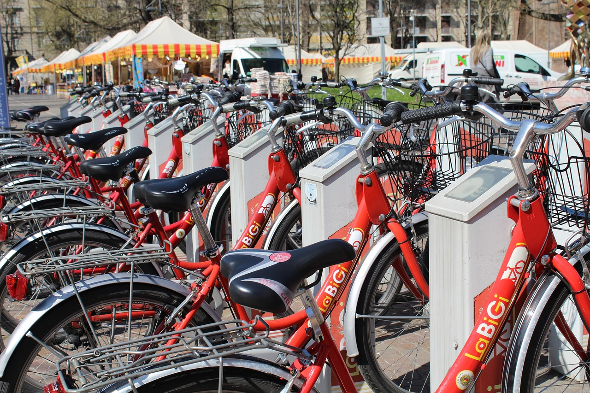

# Introduction
```{r, warning = FALSE, message = FALSE, echo = FALSE}
# import necessary libraries
library(corrplot)
library(skimr)
library(dplyr)
library(ggplot2)
library(gridExtra)
library(reshape2)
library(lares)
```
This dataset includes daily counts of rented bicycles from the Washington, D.C.-based bicycle rental firm Capital-Bikeshare, as well as weather and seasonal data. Capital-Bikeshare generously made the data publicly available. @eventlabling incorporated weather and seasonal data. The objective is to forecast how many bikes will be booked based on the weather and the time of day. For more details regarding the dataset, please refer to @ucidatasets.

(ref:bikeshare-cap) A bikesharing service (Internet image)
```{r, echo=FALSE,out.width="70%",fig.cap='(ref:bikeshare-cap)',fig.show='hold',fig.align='center'}

```
Dataset basic information:

| Variable           | Description                                            |
|--------------------|--------------------------------------------------------|
| **`cnt`** (target) | count of total rental bikes                            |
| `weathersit`       | weather situation (GOOD, or MISTY, or RAIN/SNOW/STORM) |
| `temp`             | temperature in Celsius.                                |
| `hum`              | humidity in percent                                    |
| `windspeed`        | wind speed in km/h                                     |
| `season`           | season (WINTER, SPRING, SUMMER, FALL)                  |
| `yr`               | year (2011, 2012)                                      |
| `mnth`             | month of year (JAN, FEB, ..., DEC)                     |
| `weekday`          | day of the week (SUN, MON, ..., SAT)                   |
| `holiday`          | indicator whether it is a holiday or not               |
| `workingday`       | YES if day is not weekend, otherwise is NO.            |

\clearpage

```{r, message = FALSE, warning = FALSE}
# load the dataset from OpenML Library
d <- OpenML::getOMLDataSet(data.id = 41979)
# convert the OpenML object to a tibble (enhanced data.frame)
bikeshare <- d %>% dplyr::as_tibble()
skimmed_bikeshare <- skimr::skim(bikeshare)
print(bikeshare, width = Inf)
```

# Exploratory Data Analysis (EDA)
In this part, we will walk through a few characteristics of bikeshare dataset using library `skimr` and `DataExplorer`.

## Factor variables
General statistics about factor variables from bikeshare dataset:
```{r, warning = FALSE, message = FALSE}
skimr::partition(skimmed_bikeshare)$factor %>%
        knitr::kable(format = 'latex', booktabs = TRUE) %>%
        kableExtra::kable_styling(latex_options = 'HOLD_position')
```
```{r, warning = FALSE, message = FALSE, fig.height = 5}
DataExplorer::plot_bar(
        bikeshare,
        ggtheme = ggpubr::theme_pubr(base_size = 10),
        ncol = 2,
        nrow = 2
)
```

This dataset contains 7 factor variables: `season`, `yr`, `mnth`, `holiday`, `weekday`, and `weathersit`. There is no missing data in these variables. With these 7 features, `season`, `yr`, `mnth` and `weekday` have balanced distribution across their categories. Most instances of the dataset are from non-holiday days (accounting for 97.13% of the sample size). There are more instances from working days than non-working days (68.4% of the number of instances). The weather situation is mostly good, followed by misty and lastly rain/snow/storm, with the respective percentages 63.3%, 33.8%, and 2.9%.

## Numerical variables
General statistics about numerical variables from bikeshare dataset:
```{r, warning = FALSE, message = FALSE}
skimr::partition(skimmed_bikeshare)$numeric %>%
        knitr::kable(format = 'latex', booktabs = TRUE, digits = 2) %>%
        kableExtra::kable_styling(latex_options = 'HOLD_position')
```

```{r, warning = FALSE, message = FALSE, fig.height = 3}
DataExplorer::plot_histogram(
        bikeshare,
        ggtheme = ggpubr::theme_pubr(base_size = 10)
)
```

Similar to the factor variables, there is no missing value in the numerical variables. `cnt` and `hum` have a roughly symmetric distribution, in which `hum`'s distribution also seems to have a bell shape. `temp` appears to have a bimodal distribution with the peaks at 10 and 25. Lastly, `windspeed`'s distribution is slightly right skewed.

```{r, warning = FALSE, message = FALSE, fig.height = 3}
bikeshare_numeric <- bikeshare %>% select(where(is.numeric))
bikeshare_numeric %>%
        cor() %>%
        corrplot(
           type = "upper",
           order = "hclust",
           tl.col = "black",
           tl.srt = 45,
           tl.cex = 0.7
        )
```

Through the correlation plot above, it is notable that the feature `temp` appears to have a strong positive correlation with the target `cnt`. This can be an indicator that temperature may affect the decision of customers using bikeshare services and that `temp` can be a good candidate for predicting the target.


\clearpage

# References
