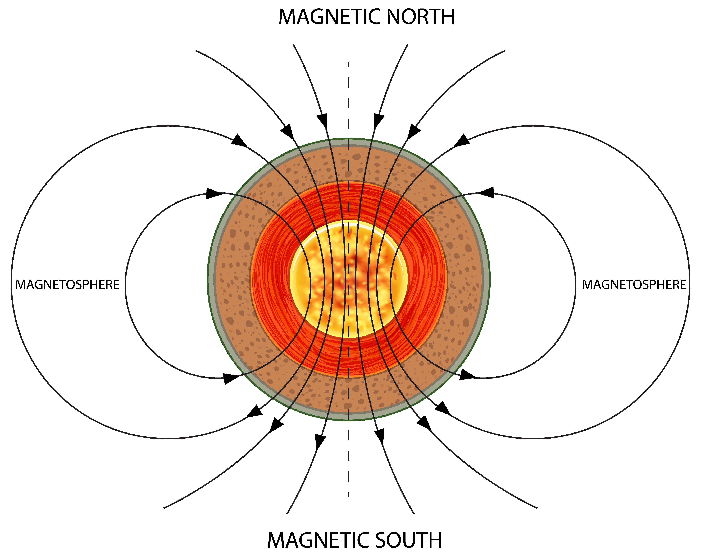

# Introduction
```{r, warning = FALSE, message = FALSE, echo = FALSE}
# import necessary libraries
library(skimr)
library(ggplot2)
library(gridExtra)
library(reshape2)
library(lares)
library(tidyverse)
library(mlbench)
library(corrplot)
theme_set(theme_bw())
```

This radar data was collected by a system near Goose Bay, Labrador. This system is made up of a phased array of 16 high-frequency antennas with a total transmission power of around 6.4 kilowatts. The free electrons in the ionosphere were the targets. "Good" radar returns are those that show indications of ionosphere structure. Those with "poor" returns do not; their signals pass through the ionosphere.

The received signals were processed using an auto-correlation function with the pulse time and number as parameters. For the Goose Bay system, there were 17 pulse numbers. In this database, instances are defined by two characteristics per pulse number, which correspond to the complex values produced by the function as a result of the complex electromagnetic signal.

These data from `mlbench` library were obtained from the UCI Repository of Machine Learning Databases, which can be found at @ucidatasets.

(ref:ionosphere-cap) Source: brgfx ([link](https://www.freepik.com/free-vector/earth-s-magnetic-field-poster_26350364.htm#query=ionosphere&position=3&from_view=search))

```{r, echo=FALSE,out.width="90%",fig.cap='(ref:ionosphere-cap)',fig.show='hold',fig.align='center'}

```
\newpage

Dataset basic information:

- **`Class`** (Target): "good"/"bad" radar signal.
- `V[1-34]`: 32 continuous variables + 2 factor variables, which represent 17 pulse numbers, each is characterized by 2 attributes.

To load the dataset, we use `mlbench`:

```{r, message = FALSE, warning = FALSE}
# load the dataset from mlbench
data(Ionosphere)
ionosphere <- Ionosphere %>% as_tibble() %>% dplyr::relocate(Class)
skimmed_ionosphere <- skimr::skim(ionosphere)
print(ionosphere)
```

# Exploratory Data Analysis (EDA)
In this part, we will walk through a few characteristics of ionosphere dataset using library `skimr` and `DataExplorer`.

## Factor variables
General statistics about factor variables from ionosphere dataset:
```{r, warning = FALSE, message = FALSE}
skimr::partition(skimmed_ionosphere)$factor %>%
        knitr::kable(format = 'latex', booktabs = TRUE) %>%
        kableExtra::kable_styling(latex_options = 'HOLD_position')
```
```{r, warning = FALSE, message = FALSE, fig.height = 2}
DataExplorer::plot_bar(ionosphere, ggtheme = ggpubr::theme_pubr(base_size = 10))
DataExplorer::plot_bar(
        ionosphere %>% select("V1", "Class"),
        by = "Class",
        by_position = "dodge",
        ggtheme = ggpubr::theme_pubr(base_size = 10)
)
```

The dataset consists of 3 factor variables: `Class` (target), `V1` and `V2`. The three variables don't have missing values. `Class` is imbalanced with 225 observations labeled as `good` ($\approx$ 64%) and 126 as `bad` ($\approx$ 36%). The factor variable `V1` is even more imbalanced with 313 data points labeled as `1` ($\approx$ 89%) and only 38 as `0` ($\approx$ 11%). Noticeably, feature `V2` only has one label `0` for all data points.

From the bar plot of feature `V1` broken down by `Class`, it can be seen that observations with `V1=0` are all labeled `bad`, while with `V1=1`, the majority of the signals is `good`. This can be a useful feature for this classification task.

## Numerical variables
General statistics about numerical variables from ionosphere dataset:
```{r, warning = FALSE, message = FALSE}
skimr::partition(skimmed_ionosphere)$numeric %>%
        knitr::kable(format = 'latex', booktabs = TRUE, digits = 2) %>%
        kableExtra::kable_styling(latex_options = 'HOLD_position')
```

From the general statistics of the numerical features, it can be seen that 32 numerical features don't have missing values. Furthermore, all the numerical features share the same range of values: `[-1,1]`.

To have a better view at the distributions of these features, let's take a look at their histograms and their boxplots (broken down by class labels).

```{r, warning = FALSE, message = FALSE, fig.height = 7.5}
DataExplorer::plot_histogram(
        ionosphere,
        ggtheme = ggpubr::theme_pubr(base_size = 10),
        ncol = 4, nrow = 8)
```
```{r, warning = FALSE, message = FALSE, fig.height = 9}
DataExplorer::plot_boxplot(
        ionosphere,
        by = "Class",
        ggtheme = ggpubr::theme_pubr(base_size = 10),
        ncol = 4, nrow = 8)
```

From the histograms, it can be seen that there are two patterns. The first pattern is that the majority of numerical features has fairly symmetrical distribution with the center and value with the highest frequency to be `0`, e.g. `V10`, `V12`, `V14`, `V16`, `V18`, etc. The second pattern is that other asymmetrically distributed numerical features appear to be highly left skewed with the mode to be `1`.

From the boxplots, there seems to be no strong relationship between any numerical feature and the class labels as the values of each feature are highly overlapping across the two class labels.

To understand more the linear relationship between the pairs of numerical variables, we create a correlation matrix:

```{r, warning = FALSE, message = FALSE}
ionosphere %>% select(where(is.numeric)) %>% cor() %>%
  corrplot(
   type = "upper",
   order = "hclust",
   tl.col = "black",
   tl.cex = 0.7
  )
```

From the correlation matrix, it can be seen that a lot of variables show strong linear relationship with each other. We can create a ranking of top 30 pairs of variables by the magnitude of correlation to interpret the result with `corr_cross` function from library `lares`:

```{r, warning = FALSE, message = FALSE}
corr_cross(ionosphere %>% select(where(is.numeric)),
  max_pvalue = 0.05, # display only significant correlations (at 5% level)
  top = 30 # display top 30 couples of variables (by correlation coefficient)
)


```
The top 30 pairs of features indicate that there are a lot of features that highly and positively correlated with each other. Noticeably, there are 3 pairs with correlation greater than 0.7, i.e. `V13-V15`, `V11-V17`, `V15-V21`, in which the pair `V15-V21` has the correlation surpassing 0.8.

\clearpage

# References