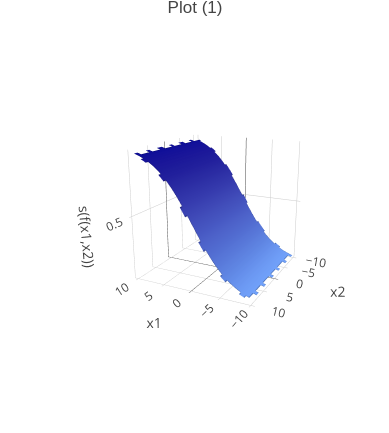
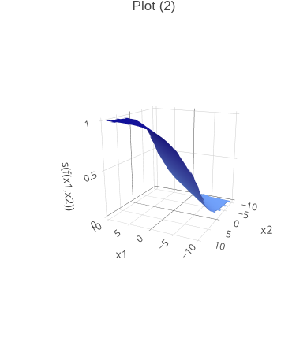
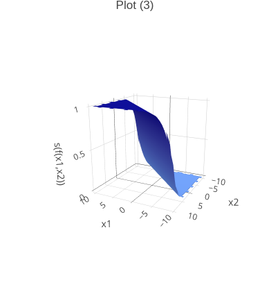
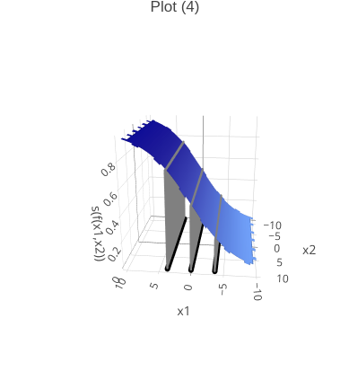

::: {.content-hidden when-format="pdf"}
::: {.hidden}

:::

:::

::: {.content-hidden when-profile="b"}

## Exercise 1: Logistic regression -- softmax link and decision boundary

::: {.callout-tip icon=false title="The whole exercise is only for lecture group A!"}
:::

::: {.callout-note title="Learning goals" icon=false}
1. Solve "show equivalence"-type questions
2. Derive the decision boundary of the logistic classifier
:::

Binary logistic regression is a special case of multiclass logistic, or softmax, regression. The softmax function is the multiclass analogue to the logistic function, transforming scores $\thetav^\top \xv$ to values in the range [0, 1] that sum to one. The softmax function is defined as:

$$
\pi_k(\xv | \thetav) = \frac{\exp(\thetav_k^\top \xv)}{\sum_{j=1}^{g} \exp(\thetav_j^\top \xv)}, k \in \{1,...,g\}
$$

a) Show that logistic and softmax regression are equivalent for $g = 2$.

::: {.content-visible when-profile="solution"}
::: {.indent-1-sol}
<details> 
<summary>**Solution**</summary>
As we would expect, the two formulations are equivalent (up to reparameterization). In order to see this, consider the softmax function components for both classes:

$$
\pi_1(\xv | \thetav) = \frac{\exp(\thetav_1^\top \xv)}{\exp(\thetav_1^\top \xv) + \exp(\thetav_2^\top \xv)}
$$

$$
\pi_2(\xv | \thetav) = \frac{\exp(\thetav_2^\top \xv)}{\exp(\thetav_1^\top \xv) + \exp(\thetav_2^\top \xv)}
$$

Since we know that $\pi_1(\xv | \thetav) + \pi_2(\xv | \thetav) = 1$, it is sufficient to compute one of the two scoring functions. Let’s pick $\pi_1(\xv | \thetav)$ and relate it to the logistic function:

$$
\pi_1(\xv | \thetav) = \frac{1}{1 + \exp(\thetav_2^\top \xv - \thetav_1^\top \xv)} = \frac{1}{1 + \exp(-\thetav^\top \xv)}
$$

where $\thetav := \thetav_1 - \thetav_2$. Thus, we obtain the binary-case logistic function, reflecting that we only need one scoring function (and thus one set of parameters $\thetav$ rather than two $\thetav_1, \thetav_2$).
</details>
:::
:::

b) Recall that in the binary case we predict $\hat{y} = 1$ iff $\pix \geq \alpha$ for a threshold $\alpha \in (0, 1)$. Show that the resulting decision boundary is a (linear) hyperplane.

   <details>
   <summary>*Hint*</summary>

   Derive the value of $\thx$ (depending on $\alpha$) starting from which you predict $\hat{y} = 1$ rather than $\hat{y} = 0$.

   </details>

::: {.content-visible when-profile="solution"}
::: {.indent-1-sol}
<details>
<summary>**Solution**</summary>

We evaluate

\begin{align*}
\pix &= \frac{1}{1 + \exp(-\thx)} = \alpha \\
&\Leftrightarrow\  1 + \exp(-\thx) = \frac{1}{\alpha} \\
&\Leftrightarrow\ \exp(-\thx) = \frac{1}{\alpha}  - 1 \\
&\Leftrightarrow\ -\thx = \log \left(\frac{1}{\alpha} - 1 \right) \\
&\Leftrightarrow\ \thx = -\log \left(\frac{1}{\alpha} - 1 \right).
\end{align*}

$\thx = -\log \left(\frac{1}{\alpha} - 1 \right)$ is the equation of a linear hyperplane, consisting of all points $\xv$ whose score $\thx$ equals $-\log \left(\frac{1}{\alpha} - 1\right)$. Since $\pix$ is increasing in $\thx$, we set $\hat y = 1$ for all points on or above this hyperplane, i.e. with $\thx \geq -\log \left(\frac{1}{\alpha} - 1\right)$.

</details>
:::
:::

:::

## Exercise 2: Hyperplanes

::: {.callout-note title="Learning goals" icon=false}
1. Understand that hyperplanes bisect the space with a linear boundary
2. Get a feeling for coefficients in hyperplane equations
3. See how the classification threshold $\alpha$ shifts the logistic decision boundary
:::

Linear classifiers like logistic regression learn a decision boundary that takes the form of a (linear) hyperplane. Hyperplanes are defined by equations $\thetav^\top \xv = b$ with coefficients $\thetav$ and a scalar $b \in \mathbb{R}$.

a) In order to see that such expressions actually describe hyperplanes, consider $\thetav^\top \xv = \theta_0 + \theta_1 x_1 + \theta_2 x_2 = 0$. Sketch the hyperplanes given by the following coefficients and explain the difference between the parameterizations:

   - $\theta_0 = 0, \theta_1 = \theta_2 = 1$
   - $\theta_0 = 1, \theta_1 = \theta_2 = 1$
   - $\theta_0 = 0, \theta_1 = 1, \theta_2 = 2$
     
::: {.content-visible when-profile="solution"}
::: {.indent-1-sol}
<details> 
<summary>**Solution**</summary>

A hyperplane in 2D is just a line. We know that two points are sufficient to describe a line, 
so all we need to do is pick two points fulfilling the hyperplane equation.

- $\theta_0 = 0, \theta_1 = \theta_2 = 1$ $\rightsquigarrow$ e.g., (0, 0) and (1, -1). Sketch it:
```{r, echo=FALSE, fig.height=3, fig.width=3}
library(ggplot2)
p = ggplot(data.frame(x = c(0, 1), y = c(0, -1)), aes(x, y)) +
  geom_point(shape = "cross") +
  geom_abline(intercept = 0, slope = -1, linetype = 2) +
  xlim(c(-2, 2)) +
  ylim(c(-2, 2)) +
  labs(x = "x1", y = "x2") +
  theme_bw()
p
```

- $\theta_0 = 1, \theta_1 = \theta_2 = 1$ $\rightsquigarrow$ e.g., (0, -1) and (1, -2). The change in $\theta_0$ promotes a horizontal shift:
```{r, echo=FALSE, fig.height=3, fig.width=3}
library(ggplot2)
p = ggplot(data.frame(x = c(0, 1), y = c(0, -1)), aes(x, y)) +
  geom_point(shape = "cross") +
  geom_abline(intercept = 0, slope = -1, linetype = 2) +
  xlim(c(-2, 2)) +
  ylim(c(-2, 2)) +
  labs(x = "x1", y = "x2") +
  theme_bw()
q = p + geom_point(
  data.frame(x = c(0, 1), y = c(-1, -2)), 
  mapping = aes(x, y), 
  shape = "cross", 
  col = "red"
  ) +
  geom_abline(intercept = -1, slope = -1, col = "red", linetype = 2) 
q
```

- $\theta_0 = 0, \theta_1 = 1, \theta_2 = 2$ $\rightsquigarrow$ e.g., (0, 0) and (1, -0.5). The change in $\theta_2$ pivots the line around the intercept:
```{r, echo=FALSE, fig.height=3, fig.width=3}
library(ggplot2)
p = ggplot(data.frame(x = c(0, 1), y = c(0, -1)), aes(x, y)) +
  geom_point(shape = "cross") +
  geom_abline(intercept = 0, slope = -1, linetype = 2) +
  xlim(c(-2, 2)) +
  ylim(c(-2, 2)) +
  labs(x = "x1", y = "x2") +
  theme_bw()
q = p + geom_point(
  data.frame(x = c(0, 1), y = c(-1, -2)), 
  mapping = aes(x, y), 
  shape = "cross", 
  col = "red"
  ) +
  geom_abline(intercept = -1, slope = -1, col = "red", linetype = 2) 
r = q + geom_point(
  data.frame(x = c(0, 1), y = c(0, -0.5)), 
  mapping = aes(x, y), 
  shape = "cross", 
  col = "blue"
  ) +
  geom_abline(intercept = 0, slope = -0.5, col = "blue", linetype = 2) 
r
```

We see that a hyperplane is defined by the points that lie directly on it and thus fulfill the hyperplane equation.

</details>
:::
:::

b) Beyond its orientation, a linear classifier also has an *offset* that determines where exactly the boundary sits. Recall that a logistic regression model estimates $\pix = \frac{1}{1 + \exp(-\thx)}$ and predicts $\hat{y} = 1$ iff $\pix \geq \alpha$ for a threshold $\alpha \in (0, 1)$. Its decision boundary is therefore the hyperplane
$$
\thx = -\log\left(\frac{1}{\alpha} - 1\right) =: b(\alpha).
$$
Consider the fixed model $\thetav = (\theta_0, \theta_1, \theta_2)^\top = (0, 1, 1)^\top$. Compute the offset $b(\alpha)$ for $\alpha \in \{0.25, 0.5, 0.75\}$, sketch the three resulting decision boundaries in a single $(x_1, x_2)$ plot, and describe how the boundary -- and the region predicted as class 1 -- changes as $\alpha$ grows. Does the orientation of the boundary change?

::: {.content-visible when-profile="solution"}
::: {.indent-1-sol}
<details>
<summary>**Solution**</summary>

For this model, $\thx = \theta_0 + \theta_1 x_1 + \theta_2 x_2 = x_1 + x_2$, so every decision boundary is a line $x_1 + x_2 = b(\alpha)$ with slope $-1$ and intercept $b(\alpha)$:

- $\alpha = 0.25$: $b(\alpha) = -\log\left(\frac{1}{0.25} - 1\right) = -\log 3 \approx -1.10$
- $\alpha = 0.5$: $b(\alpha) = -\log\left(\frac{1}{0.5} - 1\right) = -\log 1 = 0$
- $\alpha = 0.75$: $b(\alpha) = -\log\left(\frac{1}{0.75} - 1\right) = -\log \tfrac{1}{3} = \log 3 \approx 1.10$

```{r, echo=FALSE, fig.height=3, fig.width=3.5, message=FALSE, warning=FALSE}
library(ggplot2)
b <- function(a) -log(1 / a - 1)
alphas <- c(0.25, 0.5, 0.75)
df <- data.frame(alpha = factor(alphas), intercept = b(alphas), slope = -1)
ggplot(df) +
  geom_abline(
    aes(intercept = intercept, slope = slope, col = alpha),
    linetype = 2
  ) +
  xlim(c(-2, 2)) +
  ylim(c(-2, 2)) +
  labs(x = "x1", y = "x2", col = expression(alpha)) +
  theme_bw()
```

As $\alpha$ increases, the offset $b(\alpha)$ increases and the boundary shifts *parallel* toward the upper right (larger $\thx$). Since we predict $\hat{y} = 1$ wherever $\thx \geq b(\alpha)$, the region classified as class 1 (the upper-right halfplane) shrinks: a higher threshold makes the model more conservative about predicting class 1. The orientation does **not** change -- the normal vector $\thetav = (1, 1)^\top$ stays fixed, so all three boundaries are parallel. This mirrors part a), where changing the intercept $\theta_0$ produced a parallel shift of the hyperplane.

Crucially, the fitted model itself -- the logistic (S-)curve $\pix = \frac{1}{1 + \exp(-\thx)}$ -- does **not** change when we vary $\alpha$; it depends on $\thetav$ alone. Varying $\alpha$ only moves the *horizontal* cut-off through this fixed curve:

```{r, echo=FALSE, fig.height=3, fig.width=4, message=FALSE, warning=FALSE}
library(ggplot2)
sig <- function(z) 1 / (1 + exp(-z))
b <- function(a) -log(1 / a - 1)
alphas <- c(0.25, 0.5, 0.75)
z <- seq(-5, 5, length.out = 400)
curve_df <- data.frame(z = z, pi = sig(z))
cut_df <- data.frame(alpha = factor(alphas), a = alphas, b = b(alphas))
ggplot() +
  geom_line(data = curve_df, aes(z, pi)) +
  geom_hline(
    data = cut_df,
    aes(yintercept = a, col = alpha),
    linetype = 2
  ) +
  geom_segment(
    data = cut_df,
    aes(x = b, xend = b, y = 0, yend = a, col = alpha),
    linetype = 3
  ) +
  geom_point(data = cut_df, aes(x = b, y = a, col = alpha)) +
  labs(x = expression(theta^T * x), y = expression(pi(x)), col = expression(alpha)) +
  theme_bw()
```

We read off the score $b(\alpha)$ at which the curve reaches height $\pix = \alpha$ (dashed lines) and classify every point with $\thx \geq b(\alpha)$ as class 1. Thus $\alpha$ is a *post-hoc decision threshold* applied to fixed predicted probabilities, not a re-fitting of the model. The three cut-off scores $b(\alpha) \in \{-1.10, 0, 1.10\}$ (dotted verticals) are exactly the intercepts of the three parallel decision boundaries in the $(x_1, x_2)$ plot above.

</details>
:::
:::

## Exercise 3: Decision Boundaries & Thresholds in Logistic Regression

::: {.callout-note title="Learning goals" icon=false}
1. Understand that logistic regression finds a linear decision boundary
2. Get a feeling for how the parameters $\thetav$ shape predicted probabilities and model confidence
3. Understand the role of the decision threshold $\alpha$
:::

Recall from Exercise 2 that a logistic regression model estimates the probability $p(y = 1 | \xv, \thetav) = \pi(\xv | \thetav)$ and assigns $\hat{y} = 1$ iff $\pi(\xv | \thetav) \geq \alpha$ for a threshold $\alpha \in (0, 1)$. Whereas Exercise 2 b) varied the threshold for a fixed model, we now study how the parameters $\thetav$ themselves shape the predicted probabilities.

a) Below you see the logistic function for a binary classification problem with two input features for different values $\thetav^\top = (\theta_1, \theta_2)^\top$ (plots 1-3) as well as $\alpha$ (plot 4). What can you deduce for the values of $\theta_1$, $\theta_2$, and $\alpha$? What are the implications for classification in the different scenarios? In particular, which of the plots (1)--(3) shows the most confident model?

::: {.content-visible when-format="html"}
::: {.indent-1}
```{r, include=FALSE, message=FALSE, warning=FALSE, eval=knitr::is_html_output()}
suppressPackageStartupMessages(library(plotly))
suppressPackageStartupMessages(library(tidyr))
suppressPackageStartupMessages(library(dplyr))
suppressPackageStartupMessages(library(akima))

options(warn=-1)

# define x and different theta configurations
seq_x_vals <- seq(-10L, 10L, length.out = 100L)
theta <- list(
  theta_1 = c(0.3, 0),
  theta_2 = c(0.3, 0.3),
  theta_3 = c(0.8, 0.8))

plot_3d <- function(x, theta, eye = list(x = -1.5, y = 3L, z = 1L), plot_title) {
  
  # specify softmax operation
  
  compute_softmax <- function(X, theta) 1 / (1 + exp(-(X %*% theta)))
  
  # use akima interpolation to create surface from 3d points
  
  dens <- expand.grid(x_1 = x, x_2 = x)
  dens$z <- apply(as.matrix(dens), 1L, compute_softmax, theta = theta)
  d <- akima::interp(x = dens$x_2, y = dens$x_1, z = dens$z)
  
  # define perspective plot is viewed from
  
  scene = list(
    camera = list(eye = eye),
    xaxis = list(title = "x1"),
    yaxis = list(title = "x2"),
    zaxis = list(title = "s(f(x1,x2))"))
  
  # define color
  
  my_palette = c("cornflowerblue", "blue4")
  
  # plot
  
  plotly::plot_ly(x = d$x, y = d$y, z = d$z) %>%
    add_surface(
      showscale = FALSE,
      colors = my_palette
      ) %>%
    layout(scene = scene,
           title = plot_title)
  
}

# saving plotly objects requires orca installation, which might not work on 
# every device
# here: open the respective plot in your browser (clicking on "show in new 
# window" in the viewer pane) and save snapshot via the camera symbol without 
# zooming

p_1 <- plot_3d(seq_x_vals, theta$theta_1, plot_title = "Plot (1)")
p_2 <- plot_3d(seq_x_vals, theta$theta_2, plot_title = "Plot (2)")
p_3 <- plot_3d(seq_x_vals, theta$theta_3, plot_title = "Plot (3)")

# add hyperplanes marking decision boundaries for different thresholds
# use dirty trick with points, cannot get it to work with actual surface :]

add_vertical_hyperplane <- function(
    plot,
    n_points = 100L,
    theta_1 = 0.3,
    threshold = 0.5, 
    plot_title
  ) {
  
  y_vert <- seq(-10L, 10L, length.out = n_points)
  z_vert <- seq(0L, threshold, length.out = n_points)
  yz_vert <- expand.grid(y_vert, z_vert)
  
  plot %>%
  add_trace(
    inherit = FALSE,
    x = rep((- 1 / theta_1 * log(1 / threshold - 1)), n_points^2),
    y = yz_vert[, 1],
    z = yz_vert[, 2],
    marker = list(
      type = "marker",
      mode = "scatter3d",
      color = "gray",
      size = 0.8),
    showlegend = FALSE) %>%
    add_trace(
      inherit = FALSE,
      x = rep((- 1 / theta_1 * log(1 / threshold - 1)), n_points^2),
      y = yz_vert[, 1],
      z = 0L,
      marker = list(
        type = "marker",
        mode = "scatter3d",
        color = "black",
        size = 2L),
      showlegend = FALSE) %>% 
      layout(title = plot_title)
  
}

p_4 <- add_vertical_hyperplane(
  p_1 %>%
  layout(
    scene = list(camera = list(eye = list(x = -0.3, y = 3, z = 1)))), plot_title = "Plot (4)")

p_4 <- add_vertical_hyperplane(p_4, threshold = 0.25, plot_title = "Plot (4)")
p_4 <- add_vertical_hyperplane(p_4, threshold = 0.75, plot_title = "Plot (4)")

# Create a list of plots and name them
plots <- list(p_1, p_2, p_3, p_4)
names(plots) <- c("Plot (1)", "Plot (2)", "Plot (3)", "Plot (4)")
```

```{r, echo=FALSE, fig.height=2, fig.width=3, message=FALSE, warning=FALSE, eval=knitr::is_html_output(), include=knitr::is_html_output()}
#| layout-nrow: 2
plots$`Plot (1)`
plots$`Plot (2)`
plots$`Plot (3)`
plots$`Plot (4)`
```

:::
:::

::: {.content-visible when-format="pdf"}
::: {layout-nrow=2}
{fig-env="none"}

{fig-env="none"}

{fig-env="none"}

{fig-env="none"}
:::
:::

::: {.content-visible when-profile="solution"}
::: {.indent-1-sol}
<details> 
<summary>**Solution**</summary>

We observe

  - in plot (1): the logistic function runs parallel to the $x_2$ axis, so it is the same for every value of $x_2$. In other words, $x_2$ does not contribute anything to the class discrimination and its associated parameter $\theta_2$ is equal to 0.

  - in plot (2): both dimensions affect the logistic function -- to equal degree in this case, meaning $x_1$ and $x_2$ are equally important. If $\theta_1$ were larger than $\theta_2$ or vice versa the hypersurface would be more tilted towards the respective axis. Furthermore, due to $\theta_1$ and $\theta_2$ being positive, $\pix$ increases with higher values for $x_1$ and $x_2$.

  - in plot (3): this is the same situation as in plot (2) but the logistic function is steeper, which is due to $\theta_1, \theta_2$ having larger absolute values. We therefore get a sharper separation between classes (fewer predicted probability values close to 0.5, so we are overall more confident in our decision). As in plot (2), the increasing probability of $\hat{y}=1$ for higher values of $x_1$ and $x_2$ indicates positive values for $\theta_1$ and $\theta_2$.

  - in plot (4): this is the same situation as in plot (1). The different values for $\alpha$ represent different thresholds: a high value (leftmost line) means we only assign class 1 if the estimated class-1 probability is large. Conversely, a low value (rightmost line) signifies we are ready to predict class 1 at a low threshold -- in effect, this is the same as the previous scenario, only the class labels are flipped. The mid line corresponds to the common case $\alpha = 0.5$ where we assign class 1 as soon as the predicted probability is more than 50%.

In summary, **plot (3)** shows the most confident model: its steeper logistic surface pushes predicted probabilities closer to 0 or 1, yielding the sharpest class separation.

</details>
:::
:::

b) In Exercise 2 b) we simply read off the offset $b(0.5) = 0$ for the common threshold $\alpha = 0.5$. Derive this special case directly, starting from $\pix = 0.5$.

::: {.content-visible when-profile="solution"}
::: {.indent-1-sol}
<details>
<summary>**Solution**</summary>
At the decision boundary the model is exactly indifferent between the two classes, i.e., $\pix = \alpha = 0.5$:

\begin{align*}
\pix = \frac{1}{1 + \exp(-\thx)} = 0.5
&\Leftrightarrow 1 + \exp(-\thx) = 2 \\
&\Leftrightarrow \exp(-\thx) = 1 \\
&\Leftrightarrow \thx = 0.
\end{align*}

The $0.5$ threshold therefore leads to the coordinate hyperplane $\thx = 0$ and divides the input space into the positive "1" halfspace where $\thx \geq 0$ and the "0" halfspace where $\thx < 0$.

</details>
:::
:::

c) Explain when it might be sensible to set $\alpha$ to 0.5.

::: {.content-visible when-profile="solution"}
::: {.indent-1-sol}
<details> 
<summary>**Solution**</summary>

When the threshold $\alpha = 0.5$ is chosen, the losses of misclassified observations, i.e., $L(\hat{y} = 0 ~|~ y = 1)$ and $L(\hat{y} = 1 ~|~ y = 0)$, are treated equally, which is often the intuitive thing to do. It means $\alpha = 0.5$ is a sensible threshold if we do not wish to avoid one type of misclassification more than the other. If, however, we need to be cautious to only predict class 1 if we are very confident (for example, when the decision triggers a costly therapy), it would make sense to set the threshold considerably higher.

</details>
:::
:::

::: {.content-hidden when-profile="a"}

## Exercise 4: Thresholds and predictions in practice

::: {.callout-tip icon=false title="The whole exercise is only for lecture group B!"}
:::

::: {.callout-note title="Learning goals" icon=false}
1. Compute predictions of a logistic model by hand
2. Understand how the threshold $\alpha$ trades off the two error types
:::

Consider a fitted binary logistic regression model with parameter vector $\thetav = (\theta_0, \theta_1, \theta_2)^\top = (-1, 2, 1)^\top$, so that
$$
\pix = \frac{1}{1 + \exp\left(-(\theta_0 + \theta_1 x_1 + \theta_2 x_2)\right)}.
$$
Recall that we predict $\hat{y} = 1$ iff $\pix \geq \alpha$.

a) Compute the predicted probability $\pix$ for the following observations and classify them using the default threshold $\alpha = 0.5$:

   - $\xv^{(1)} = (x_1, x_2)^\top = (1, 1)^\top$
   - $\xv^{(2)} = (1, -1)^\top$
   - $\xv^{(3)} = (0, 0)^\top$

::: {.content-visible when-profile="solution"}
::: {.indent-1-sol}
<details>
<summary>**Solution**</summary>

We plug each observation into $\thx = \theta_0 + \theta_1 x_1 + \theta_2 x_2$ and apply the logistic function:

- $\xv^{(1)}$: $\thx = -1 + 2 \cdot 1 + 1 \cdot 1 = 2 \;\Rightarrow\; \pix = \frac{1}{1 + \exp(-2)} \approx 0.88 \;\Rightarrow\; \hat{y} = 1$
- $\xv^{(2)}$: $\thx = -1 + 2 \cdot 1 + 1 \cdot (-1) = 0 \;\Rightarrow\; \pix = \frac{1}{1 + \exp(0)} = 0.5 \;\Rightarrow\; \hat{y} = 1$ (exactly on the boundary, where $\pix = \alpha$)
- $\xv^{(3)}$: $\thx = -1 + 2 \cdot 0 + 1 \cdot 0 = -1 \;\Rightarrow\; \pix = \frac{1}{1 + \exp(1)} \approx 0.27 \;\Rightarrow\; \hat{y} = 0$

Note that $\xv^{(2)}$ lies exactly on the $\alpha = 0.5$ decision boundary $\thx = 0$ derived in Exercise 3 b).

</details>
:::
:::

b) For observation $\xv^{(1)}$, from which threshold $\alpha$ onwards would the model predict $\hat{y} = 0$ instead?

::: {.content-visible when-profile="solution"}
::: {.indent-1-sol}
<details>
<summary>**Solution**</summary>

Since $\hat{y} = 1$ iff $\pix \geq \alpha$, the prediction for $\xv^{(1)}$ switches to $\hat{y} = 0$ as soon as $\alpha > \pi(\xv^{(1)}) \approx 0.88$. In other words, we would only predict class 0 for this observation if we demanded a class-1 probability of more than about $88\%$.

</details>
:::
:::

c) The model is used in a hospital to decide whether to start an expensive and invasive therapy ($\hat{y} = 1$). Would you rather choose a high or a low threshold $\alpha$? Which type of error (false positive / false negative) does your choice avoid, and at what cost?

::: {.content-visible when-profile="solution"}
::: {.indent-1-sol}
<details>
<summary>**Solution**</summary>

If the therapy itself is costly and invasive, we want to be sure a patient really needs it before starting it, i.e., only predict $\hat{y} = 1$ when we are very confident. This calls for a **high** threshold $\alpha$: it reduces **false positives** (healthy patients undergoing an unnecessary, harmful therapy), at the price of more **false negatives** (patients who would benefit are not treated).

The "right" choice therefore depends on the relative costs of the two error types. If missing a case were far more dangerous than an unnecessary treatment (e.g., a life-threatening but easily treatable disease), we would instead prefer a **low** $\alpha$ to avoid false negatives.

</details>
:::
:::

:::
